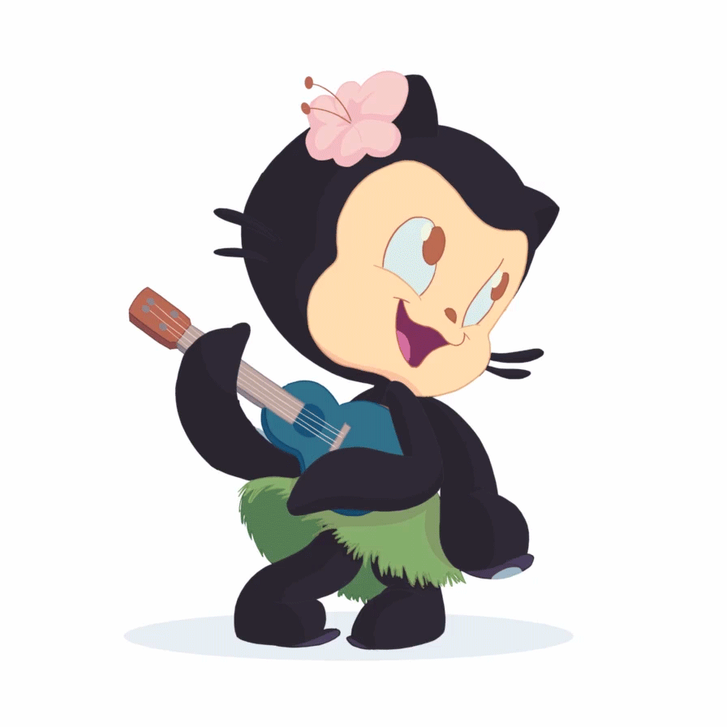

<!---->

Hi 👋 I am an HTML/CSS web developer. I am currently actively studying JavaScript frameworks, especially React.JS, as well as practicing my skills in HTML/CSS and sometimes fulfilling small orders. I have experience working as an HTML/CSS developer and I am striving to become a full-fledged front-end developer.

<!--
**NIFUROXCAZID/NIFUROXCAZID** is a ✨ _special_ ✨ repository because its `README.md` (this file) appears on your GitHub profile.

Here are some ideas to get you started:

- 🔭 I’m currently working on ...
- 🌱 I’m currently learning ...
- 👯 I’m looking to collaborate on ...
- 🤔 I’m looking for help with ...
- 💬 Ask me about ...
- 📫 How to reach me: ...
- 😄 Pronouns: ...
- ⚡ Fun fact: ...
-->
